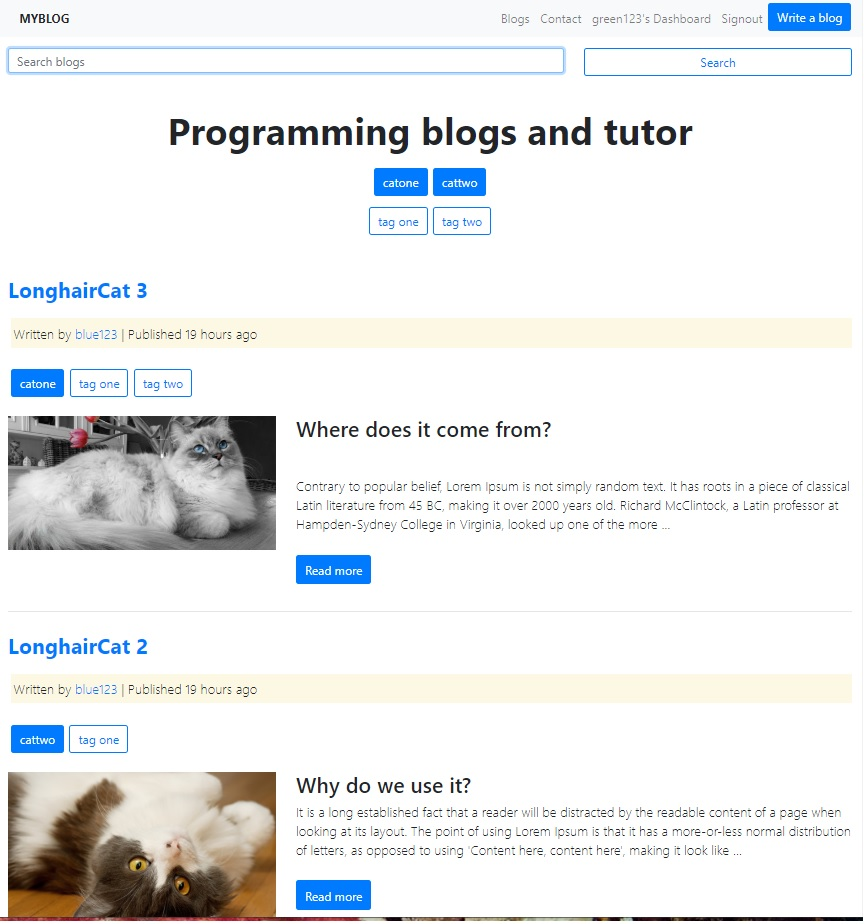
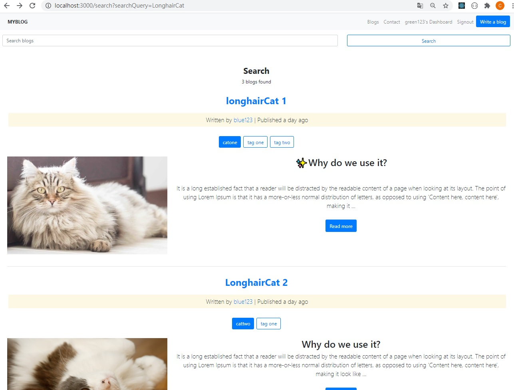
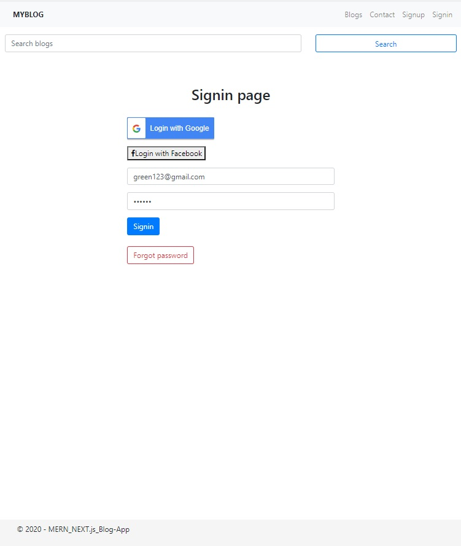
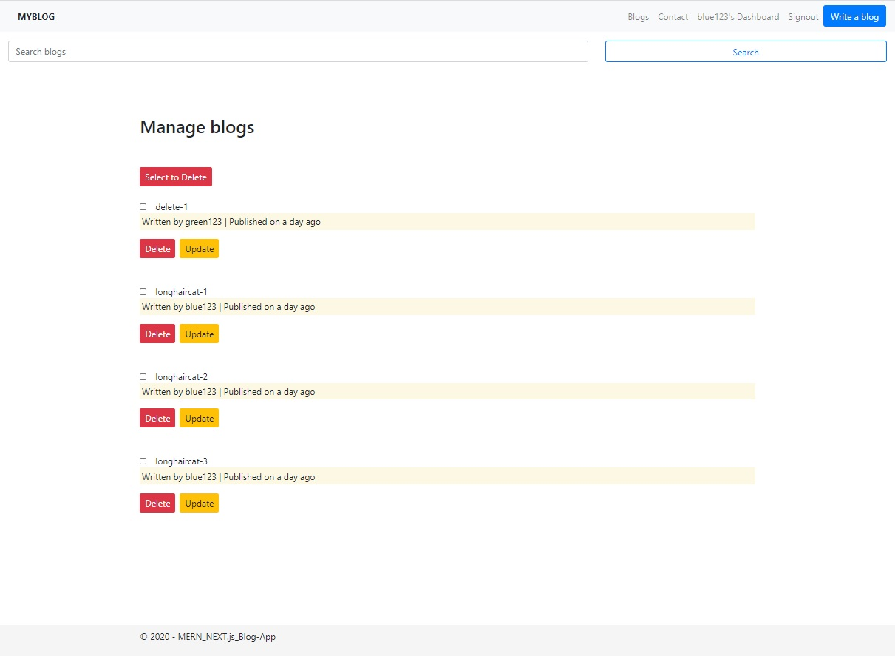
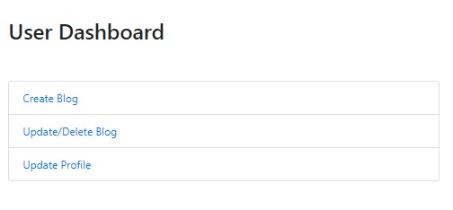
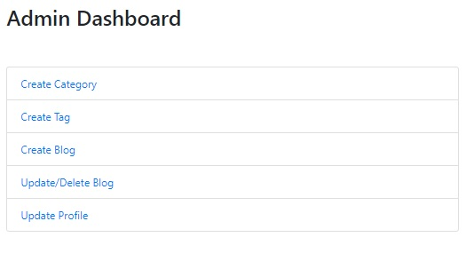
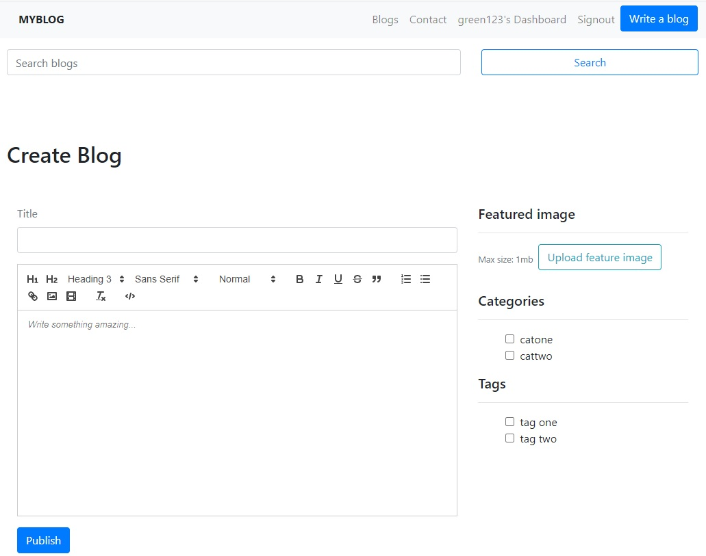
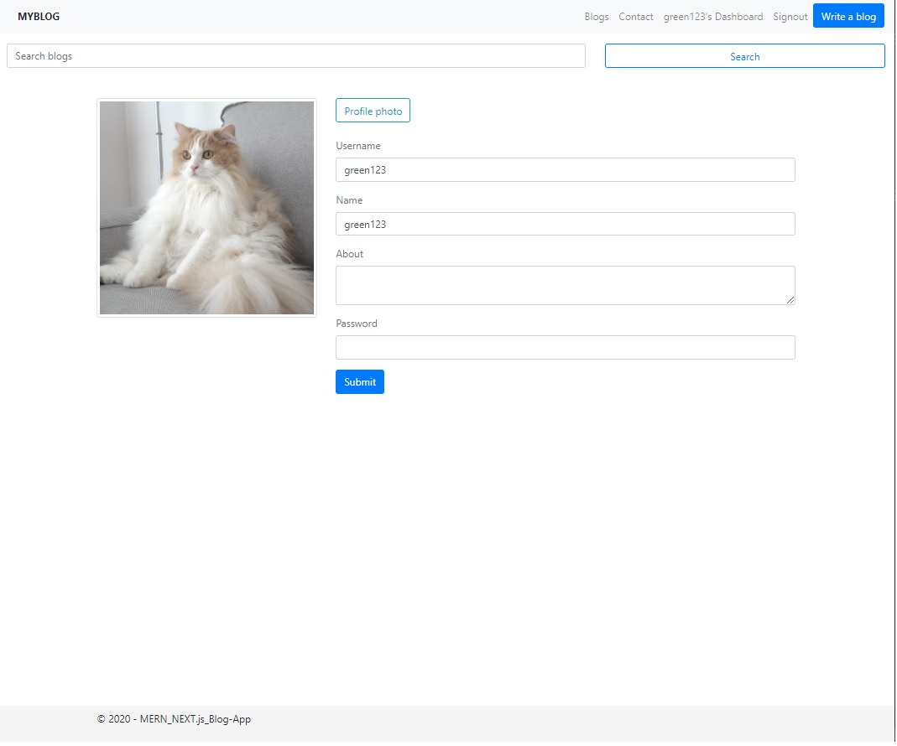

# MERN_Next.js - Blog Project
部落格網站實作練習MERN_FullStack專案，使用 Restful Web API

## 後端
[node.js後端程式碼](https://github.com/Hankscr459/mern_blogs_server)

## 作品簡介

* 前台
  * 主頁面
  * 部落格頁
  * 文章留言(DisqusThread插件)
  * 分類頁
  * 搜尋文章(輸入關鍵字送出，跳轉至搜尋結果頁)
  * 管理員&使用者 登入/註冊 頁, Google & Facebook 登入, 忘記密碼(sendgrid插件)寄送

* 後台
  * 文章管理頁(CRUD)
  * 分類頁管理頁(CRUD)
  * 管理員&使用者管理頁(CRUD)

